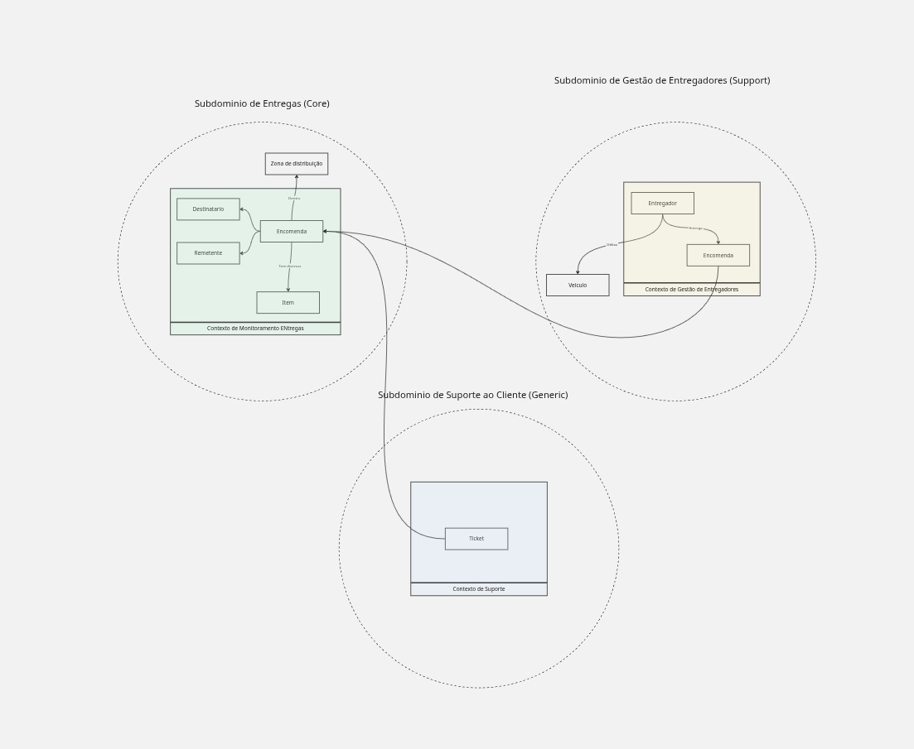

# Delivery Microservices


Projeto de estudos sobre **arquitetura de microsserviços**, utilizando como domínio uma plataforma de delivery.

O objetivo é explorar, de forma prática, conceitos de **Domain-Driven Design (DDD)**, microsserviços, contextos delimitados, comunicação entre serviços, mensageria, persistência e outros padrões relacionados à construção de sistemas distribuídos.

> **Projeto educacional:** desenvolvido para estudos, experimentação arquitetural e aprofundamento em desenvolvimento de sistemas distribuídos.

---

## Visão geral

O domínio foi dividido considerando diferentes **subdomínios e contextos**, buscando manter responsabilidades bem definidas entre os serviços.

### Subdomínios

| Subdomínio                    | Classificação | Responsabilidade                                      |
| ----------------------------- | ------------- | ----------------------------------------------------- |
| **Entregas**                  | Core          | Gestão do processo de entrega                         |
| **Gestão de Entregadores**    | Support       | Gestão dos entregadores e sua relação com encomendas  |
| **Suporte ao Cliente**        | Generic       | Funcionalidades relacionadas ao atendimento e suporte |
| **Monitoramento de Entregas** | Contexto      | Acompanhamento e monitoramento das entregas           |

---

## Domínio de Entregas — Core

O **Subdomínio de Entregas** representa o núcleo principal do negócio.

Principais conceitos:

* **Destinatário**
* **Remetente**
* **Encomenda**
* **Item**

Esse contexto concentra as regras relacionadas à criação e gerenciamento das encomendas e ao processo de entrega.

---

## Gestão de Entregadores — Support

Responsável pelas funcionalidades relacionadas à gestão dos profissionais responsáveis pelas entregas.

Principais conceitos:

* **Entregador**
* **Encomenda**

Esse contexto possui suas próprias responsabilidades e regras, evitando que o domínio de entregas concentre também as regras específicas da operação dos entregadores.

---

## Monitoramento de Entregas

Contexto responsável pelo acompanhamento do processo de entrega.

A ideia é explorar a separação entre o processo transacional de uma entrega e as necessidades de **monitoramento e acompanhamento do seu estado**.

---

## Suporte ao Cliente — Generic

Contexto destinado às funcionalidades relacionadas ao **suporte e atendimento ao cliente**.

A implementação desse contexto será utilizada também para explorar como um domínio genérico pode se integrar aos demais contextos sem assumir responsabilidades que pertencem ao domínio principal.

---

## Arquitetura

A arquitetura do projeto será organizada em múltiplos microsserviços, buscando aplicar os princípios de:

* Domain-Driven Design
* Bounded Contexts
* Separação de responsabilidades
* Baixo acoplamento
* Alta coesão
* Comunicação entre serviços
* Processamento assíncrono
* Persistência independente
* Observabilidade
* Resiliência

### Visão arquitetural

> Os diagramas arquiteturais do projeto serão adicionados nesta seção conforme a evolução da implementação.

```text
                        ┌─────────────────────┐
                        │     Delivery        │
                        │      Platform       │
                        └──────────┬──────────┘
                                   │
             ┌─────────────────────┼─────────────────────┐
             │                     │                     │
             ▼                     ▼                     ▼
      ┌─────────────┐       ┌─────────────┐       ┌─────────────┐
      │   Delivery  │       │   Courier   │       │   Support   │
      │    Core     │       │  Management │       │   Customer  │
      └─────────────┘       └─────────────┘       └─────────────┘
             │                     │                     │
             └─────────────────────┼─────────────────────┘
                                   ▼
                          ┌─────────────────┐
                          │   Monitoring    │
                          │    Context     │
                          └─────────────────┘
```

---
## Diagrama de Modelagem



## Microsserviços

A estrutura inicial do projeto será organizada da seguinte forma:

```text
delivery-microservices/
│
├── ms-delivery/
│
├── ms-courier/
│
├── ms-customer-support/
│
├── docs/
│   └── diagrams/
│
├── docker-compose.yml
│
└── README.md
```

Cada microsserviço possuirá seu próprio contexto, modelo de domínio e responsabilidades.

---

## Tecnologias

As tecnologias serão utilizadas conforme a evolução do projeto.

### Backend

* Java
* Spring Boot
* Spring Framework
* Spring Data
* Maven

### Arquitetura

* Microservices
* Domain-Driven Design
* Bounded Context
* Event-Driven Architecture
* REST APIs
* Mensageria

### Infraestrutura

* Docker
* Docker Compose

### Persistência

* PostgreSQL

### Qualidade

* JUnit
* Testes automatizados
* Clean Code
* SOLID

---

## Objetivos de estudo

Este projeto tem como principais objetivos aprofundar conhecimentos em:

* [ ] Modelagem estratégica utilizando DDD
* [ ] Identificação de subdomínios
* [ ] Definição de Bounded Contexts
* [ ] Decomposição de sistemas em microsserviços
* [ ] Comunicação síncrona entre serviços
* [ ] Comunicação assíncrona
* [ ] Mensageria e eventos
* [ ] Consistência de dados em sistemas distribuídos
* [ ] Transações distribuídas
* [ ] Idempotência
* [ ] Resiliência
* [ ] Observabilidade
* [ ] Testes de microsserviços
* [ ] Containerização
* [ ] Orquestração
* [ ] CI/CD

---

## Princípios arquiteturais

Durante o desenvolvimento, o projeto busca aplicar alguns princípios fundamentais:

### Autonomia

Cada microsserviço deve possuir responsabilidade clara sobre seu contexto e minimizar dependências desnecessárias de outros serviços.

### Bounded Context

Os modelos de domínio são definidos dentro dos limites de cada contexto, evitando a criação de um modelo único compartilhado por todo o sistema.

### Baixo acoplamento

A comunicação entre os serviços deve evitar dependências excessivas e permitir que cada serviço evolua de forma independente.

### Alta coesão

As regras e responsabilidades relacionadas ao mesmo contexto devem permanecer próximas.

### Evolução incremental

A arquitetura será construída de maneira incremental, permitindo avaliar as decisões arquiteturais conforme novas necessidades surgirem.

---

## Documentação

Os diagramas e decisões arquiteturais do projeto ficarão disponíveis em:

```text
docs/
├── diagrams/
└── architecture/
```

Documentações previstas:

* Context Map
* Bounded Contexts
* Diagrama de arquitetura
* Fluxos de comunicação
* Modelos de domínio
* Decisões arquiteturais

---

## Como executar

> A documentação de execução será adicionada conforme os microsserviços forem implementados.

A intenção é permitir que todo o ambiente seja iniciado utilizando:

```bash
docker compose up -d
```

---

## Status

🚧 **Em desenvolvimento**

O projeto está sendo desenvolvido de forma incremental, com novas funcionalidades e componentes arquiteturais sendo adicionados conforme os estudos avançam.

---

## Objetivo

Este projeto não tem como objetivo apenas implementar uma aplicação de delivery, mas servir como um **laboratório prático para estudo de microsserviços e arquitetura de software**, permitindo experimentar diferentes abordagens e analisar suas vantagens, limitações e trade-offs.
